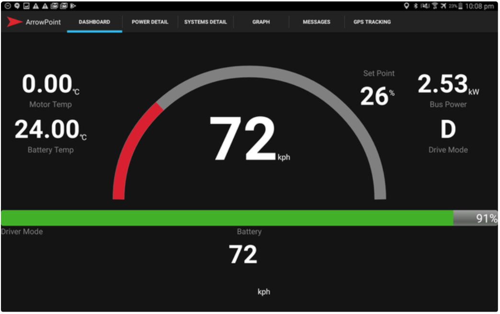

The ArrowPoint for Android Solution is an Android App designed to receive and display telemetry information from an WiFi access point in real time. It is a very useful tool in a race environment as every team member can have a copy installed on their own phone or tablet and get instant insights in to the performance of the vehicle.

<figure markdown>

<figcaption>ArrowPoint Dashboard</figcaption>
</figure>

The out of the box implementation is designed for use in Solar or Electric racing cars that use technology from [Prohelion](https://www.prohelion.com) or [Tritium](https://www.tritiumcharging.com). This solution was originally developed by [TeamArrow](https://www.teamarrow.com.au/) and has been used in racing environments since 2015. [TeamArrow](https://www.teamarrow.com.au/) continue to use this application both as the in car dashboard as well as a solution for the entire fleet to communicate and monitor the car.

Examples of the software in use can be seen here - [https://www.youtube.com/watch?reload=9&v=lWkXEb8v1tk](https://www.youtube.com/watch?reload=9&v=lWkXEb8v1tk)

## Features
The application provides

- A [Driver Dashboard](Dashboard.md) showing all key information for the driver (we use this as our in car dashboard in the Arrow1)
- A [Solar Energy Dashboard](Solar.md) showing key solar data and battery information
- [Customizable Alerts](SystemDetails.md) that can be used to alert the team or driver to systems going out of range or offline
- [Private Messaging](Fleet_Messaging.md) for inter-fleet communications that does not require the radio
- A [Graphing Dashboard](Graphing.md) that can be used to graph information over time
- [Basic GPS tracking](GPS.md) system to track the car location

The application is compatible with

- Prohelion Battery Packs
- Prohelion & Tritium WaveSculptors
- Prohelion & Tritium BMUs and CMUs

The Wifi connection should be broadcasting CAN Bus data using the Prohelion and Tritium CAN Bus identifiers.

Any issues please or question, please raise them on our GitHub account at [https://github.com/Prohelion/ArrowPoint-Android](https://github.com/Prohelion/ArrowPoint-Android)
